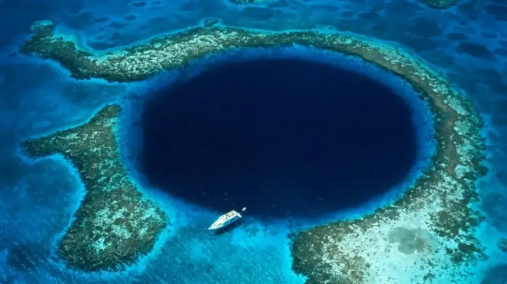

# Los Misterios del Mar

El **mar** ha sido fuente de inspiración, miedo y fascinación a lo largo de la historia. Cubriendo más del *70% de la superficie terrestre*, sigue siendo uno de los lugares más desconocidos del planeta.

---

## 1. La Inmensidad Azul

El océano es el hogar de millones de especies, muchas de las cuales aún no han sido descubiertas.  
Entre las zonas más enigmáticas se encuentra la **Fosa de las Marianas**, el punto más profundo de la Tierra, con más de *11.000 metros* de profundidad.


[Fosa de las Marianas](https://es.wikipedia.org/wiki/Fosa_de_las_Marianas)

> A esa profundidad, la presion es más de **mil veces mayor** que a nivel del mar.

### Ejemplo de código en JavaScript

```javascript
const profundidadMariana = 11034; // en metros
const presionSuperficie = 1; // atmósfera
const presionFosa = presionSuperficie * 1100;

console.log(`La presión en la Fosa de las Marianas es de aproximadamente ${presionFosa} atmósferas.`);


